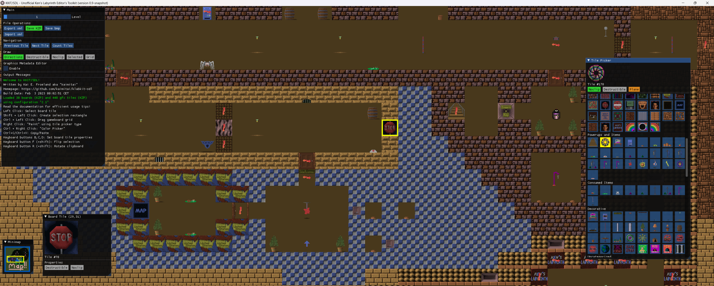

# KKIT/SDL - Unofficial Ken's Labyrinth Editor's Toolkit

Welcome to the KKIT/SDL code repository and release page. The current version of the editor is 0.2. The code is standard C++20, and the project files were created using Microsoft Visual Studio Community 2022. You can compile the code from source, or get the latest precompiled win-x64 distribution under the [repository releases](https://github.com/kaimitai/klabkit-sdl/releases/). \
Make sure to read the included documentation (readme.html in the docs folder) for a detailed overview.
  
### Editor Capabilities
The editor in its current state is fairly complete, but I cannot guarantee that there are no bugs. We support editing all versions of Ken's Labyrinth, including the early tech demo "Walken". As of now, the editor has the following functionality:
  
### Level Editing
The main part of the editor is of course level editing. The "Boards" screen presents all the levels in a file in a graphical way, indicating which properties any map tile has. The board is presented on a zoomable grid, with copy/paste capabilities and several logical operations. The editor is mostly mouse-driven, but supports keyboard shortcuts for most operations.
  
We can save the boards to compressed and uncompressed formats, and we also support our own XML format - which allows users to more easily compare file versions, use version control systems to track file history, and collaborate on level pack projects.

###### The editor will show all the level and tile information
  
### Graphics viewer, exporter and importer
In the Gfx screen, the tile metadata can be viewed and edited. The bitmaps themselves can be exported to - and imported from - BMP files. We also support our own XML format for tiles.
  

###### The gfx screen showing some tiles from Ken's Labyrinth v2.1
  
### Command-line interface
We also include a command-line tool, KKIT/CLI, which can decompress and compress the rest of the game data, like music and sounds. This tool also supports all versions.
  
### Version History
2023-01-31: v0.2
* Added support (datafiles and configuration) for recently released game version "Walken 08 23 1992"; configuration #5 in kkit-sdl-config.xml
* Added textured minimap to the Board screen, which will give a live view of the in-game minimap
* Added keyboard shortcut Ctrl+A to select the whole board in the board screen
* Added support for exporting all tiles as a tilemap bmp, and saving the palette as a bmp, in the Gfx screen
* Saving a board as BMP will include the player start position, a configurable floor color, and will indicate all noclip and destructible tiles - if the corresponding flash toggles are turned on in the Boards-screen
* The buttons "Save KZP" and "Save DAT" will be color coded according to the loaded game version, and each game configuration got a "preferred extension" attribute for the files BOARDS and WALLS
* Fixed a bug where the toast notification would render as a black rectangle when resizing the window
* Adding missing documentation: Shift+Plus/Minus in the Boards-screen will go to the next/previous board

2022-05-15: v0.1c
* Changed the application name to KKIT/SDL: Unofficial Ken's Labyrinth Editor's Toolkit (to avoid any confusion with the [original Developer's Toolkit]("http://advsys.net/ken/klab.htm#klabkit"))
* Updated documentation; clarified how to switch between lab3d-versions
* Added shortcut shift+H to set player start position at selected board tile (to avoid having to use the tile picker)

2022-05-10: v0.1b
* Initial Release, v0.1b

### Upcoming changes in the next version
* Complete UI overhaul, letting the whole screen be taken advantage of. A preview of the editor running on a widescreen in the development version:

"Ken's Labyrinth" Copyright (c) 1992-1993 Ken Silverman \
Ken Silverman's official web site: "http://www.advsys.net/ken"
