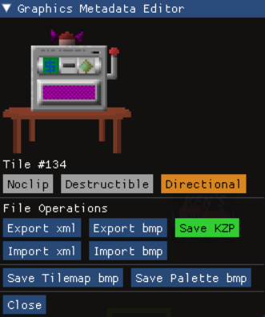

# KKIT/SDL - Unofficial Ken's Labyrinth Editor's Toolkit

Welcome to the KKIT/SDL code repository and release page. The current version of the editor is 0.1c. The code is standard C++20, and the project files were created using Microsoft Visual Studio Community 2022. You can compile the code from source, or get the latest precompiled win-x64 distribution under the [repository releases](https://github.com/kaimitai/klabkit-sdl/releases/). \
Make sure to read the included documentation (readme.html in the docs folder) for a detailed overview.
  
### Editor Capabilities
The editor in its current state is fairly complete, but I cannot guarantee that there are no bugs. We support editing all versions of Ken's Labyrinth, including the early tech demo "Walken". As of now, the editor has the following functionality:
  
### Level Editing
The main part of the editor is of course level editing. The "Boards" screen presents all the levels in a file in a graphical way, indicating which properties any map tile has. The board is presented on a zoomable grid, with copy/paste capabilities and several logical operations. The editor is mostly mouse-driven, but supports keyboard shortcuts for most operations.
  
We can save the boards to compressed and uncompressed formats, and we also support our own XML format - which allows users to more easily compare file versions, use version control systems to track file history, and collaborate on level pack projects.

###### The editor will show all the level and tile information
  
### Graphics viewer, exporter and importer
In the Gfx screen, the tile metadata can be viewed and edited. The bitmaps themselves can be exported to - and imported from - BMP files. We also support our own XML format for tiles.
  

###### The gfx screen showing some tiles from Ken's Labyrinth v2.1
  
### Command-line interface
We also include a command-line tool, KKIT/CLI, which can decompress and compress the rest of the game data, like music and sounds. This tool also supports all versions.
  
### Upcoming changes in the next release
* Textured Minimap! The minimap in the Boards-screen will show a live texture of what the in-game map looks like. (replacing the current all-black square)
* Adding gamefiles and configuration for the most recently released game version "Walken 08 23 1992" (configuration #5 in klabkit-sdl-config.xml)
* The Gfx-screen will have new buttons to save the entire tilemap as a single BMP file, and for dumping the palette as a 16x16 image.
* Saving a board as BMP will include the player start position, a configurable floor color, and will indicate all noclip and destructible tiles - if the corresponding flash toggles are turned on in the Boards-screen.
* More keyboard shortcuts: Ctrl+A to select all in the Boards-screen, arrow keys for navigating the Gfx screen.
* Fixed a bug where the toast notification would render as a black rectangle when resizing the window.
* The buttons "Save KZP" and "Save DAT" will be color coded according to the loaded game version
* Adding missing documentation: Shift+Plus/Minus in the Boards-screen will go to the next/previous board.

  
"Ken's Labyrinth" Copyright (c) 1992-1993 Ken Silverman \
Ken Silverman's official web site: "http://www.advsys.net/ken"
